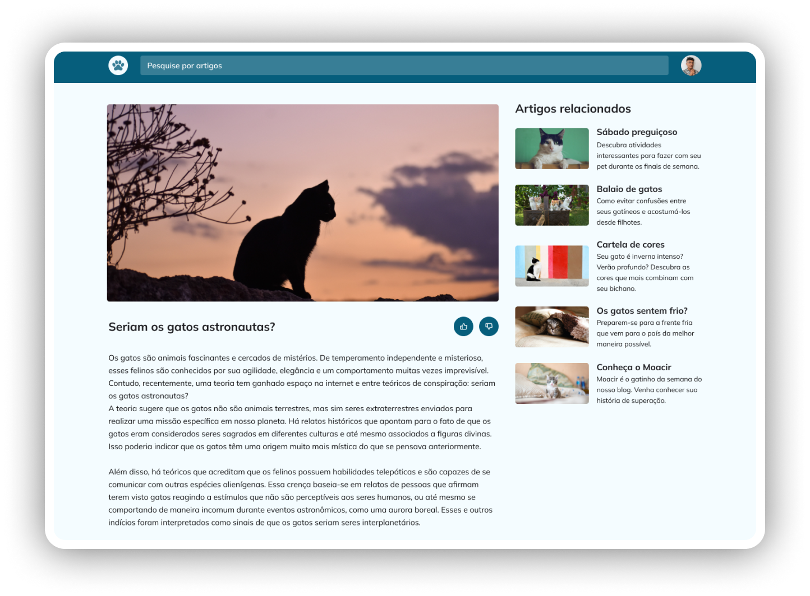

# 💻 Sobre o desafio

E aí, curtiu aprender mais sobre responsividade, grid e animações? 👀
Então bora colocar em prática tudo o que foi visto nesse nível! 😍

Cadê os amantes de gatinhos por aqui? A ideia agora é criar o **Blog de Gatos**! 🐈‍⬛

Aqui está o **[link](https://www.figma.com/community/file/1256354927622258124/Blog-de-Gatos-%E2%80%A2-Desafio-Explorer)** com o layout da aplicação. 
Ele abrirá uma cópia do arquivo igual a imagem abaixo:

Topa encarar esse desafio? 💜
Vai ser muito importante para o seu aprendizado rever e aplicar esses novos conceitos. 